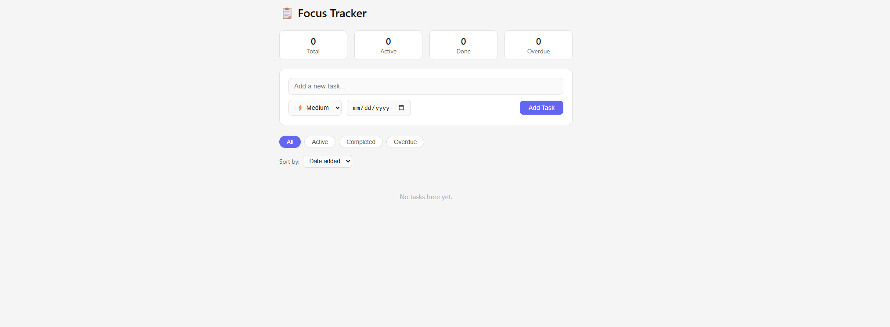

# Focus Tracker

A clean, responsive to-do manager built with vanilla HTML, CSS, and JavaScript — no frameworks, no dependencies.

🔗 **[Live Demo](https://Kingmamba04.github.io/Focus-Tracker)**

---

## Features

- **Add tasks** with a title, priority level, and optional due date
- **Priority levels** — High, Medium, and Low with color-coded badges
- **Overdue detection** — tasks past their due date are automatically flagged
- **Filter tasks** — view All, Active, Completed, or Overdue
- **Sort tasks** — by date added, due date, or priority
- **Persistent storage** — tasks are saved across sessions
- **Stats dashboard** — live counts for total, active, completed, and overdue tasks
- **Keyboard support** — press Enter to quickly add a task

## Tech Stack

| Technology | Usage |
|---|---|
| HTML5 | Structure and layout |
| CSS3 | Styling, responsive design |
| Vanilla JavaScript | App logic, DOM manipulation |
| Web Storage API | Persistent data across sessions |

## Getting Started

No installation or build step required.

```bash
git clone https://github.com/Kingmamba/Focus-Tracker.git
cd Focus-Tracker
open index.html
```

Or just open `index.html` directly in any modern browser.

## Project Structure

```
Focus-Tracker/
└── index.html      # Full app — markup, styles, and logic in one file
└── README.md       # Project documentation
```

## Screenshots



## What I Learned

- Building a fully functional CRUD app with no libraries or frameworks
- Managing application state and persisting it with the Web Storage API
- Writing clean, maintainable CSS without a design system
- Implementing dynamic filtering and sorting logic in vanilla JS

## License

MIT — free to use and modify.
